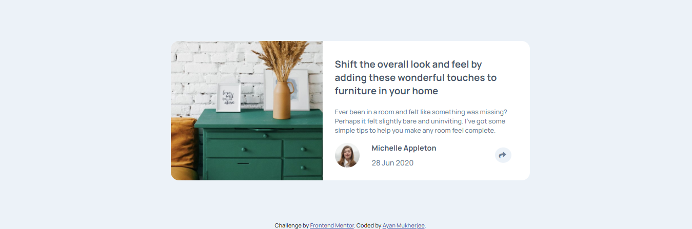
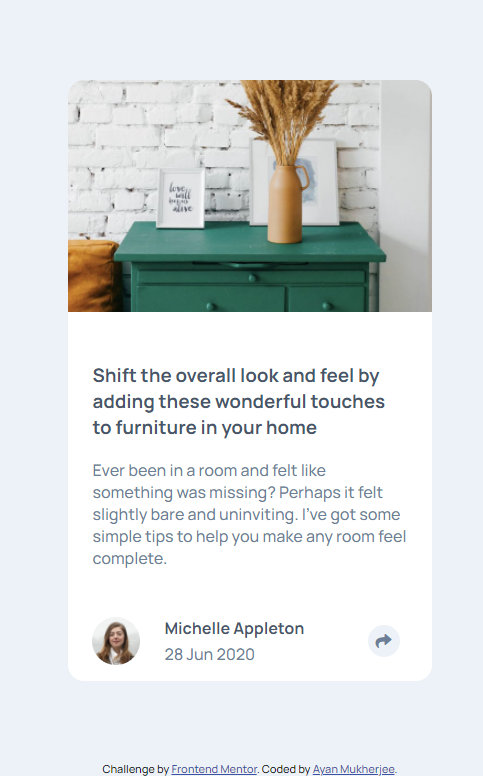

# Frontend Mentor - Article preview component solution

This is a solution to the [Article preview component challenge on Frontend Mentor](https://www.frontendmentor.io/challenges/article-preview-component-dYBN_pYFT). Frontend Mentor challenges help you improve your coding skills by building realistic projects. 

## Table of contents

- [Overview](#overview)
  - [Screenshot](#screenshot)
  - [Links](#links)
- [My process](#my-process)
  - [Built with](#built-with)
  - [Useful resources](#useful-resources)
- [Author](#author)

## Overview

### Screenshot

### Links

- Solution URL: [Solution](https://github.com/mukherjee-ayan/Article-Preview-Component)
- Live Site URL: [Live Site](https://mukherjee-ayan.github.io/Article-Preview-Component/)

## My process

### Built with

- Semantic HTML5 markup
- CSS custom properties
- JavaScript
- Mobile-first workflow
- [jQuery](https://jquery.com/download/) - JS library

### Useful resources

- [CSS Tooltip With Simple Popover | HTML5 & CSS3](https://www.youtube.com/watch?v=hY9AAF-wZMo) - This helped me in designing the popover. I really liked this pattern and will use it going forward.

## Author

- LinkedIn - [Ayan Mukherjee](https://www.linkedin.com/in/m-ayan)
- Frontend Mentor - [@mukherjee-ayan](https://www.frontendmentor.io/profile/mukherjee-ayan)
- GitHub - [Ayan Mukherjee](https://github.com/mukherjee-ayan)
